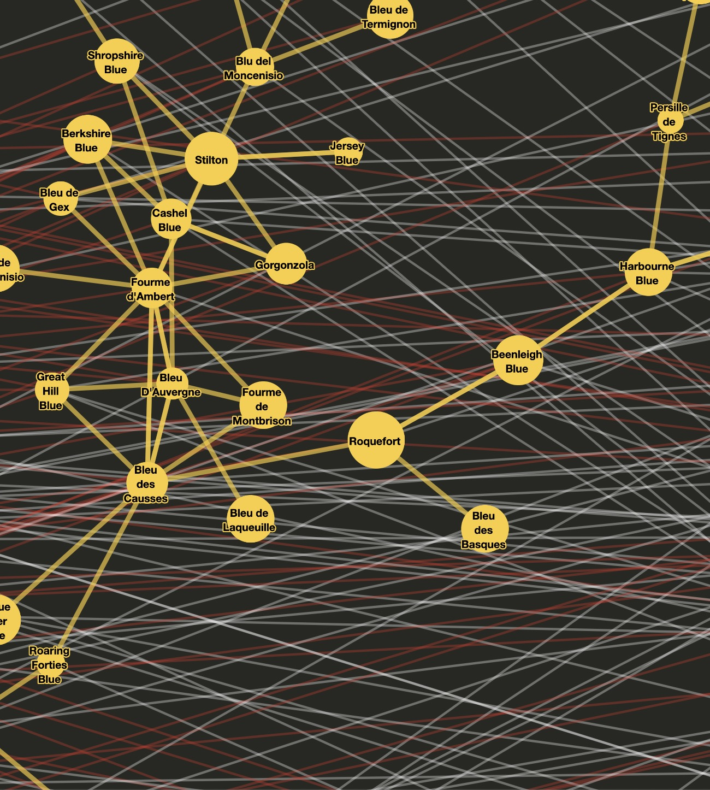

# TodoList
- [ ] [wiki-api 翻译计划](https://github.com/dagrejs/dagre/wiki#browser-scripts)  - 2020/03/16 12:11
- [ ] [graphlib api](https://github.com/dagrejs/graphlib/wiki/API-Reference) - 2020/03/17 10:11

> 中文 | [English](ReadMe.md)

[](http://choosealicense.com/licenses/mit/)

<h3>目录</h3>

[TOC]

# dagre-d3
[Dagre](https://github.com/dagrejs/dagre)是一个JavaScript库, 可以更轻易得在客户端布局连接图。此库是dagre的前端子库, 底层使用[D3](http://d3js.org)进行渲染。

如果要查看更多详细信息(包含样例和配置在内), 请查看[wiki](https://github.com/dagrejs/dagre-d3/wiki)页面。

# 设计优先级
1. 完全的客户端计算布局。如果客户端布局对你来说并非所需, 可以查看[graphviz](http://www.graphviz.org/), 这是个功能丰富的代替品。

样式举例:
<a href="http://yifanhu.net/GALLERY/GRAPHS/index.html"></a>

2. 速度。Darge为了更快得绘制中等图像, kennel不会采用更合适、准确的算法。
3. 渲染的不可知性。Darge仅需要非常基础的信息就能绘制图像,比如节点的维度。你可以自由地使用任何你喜欢的技术渲染图形。此处推荐学习[d3](https://github.com/d3/d3)。

# 安装
## npm 
在安装这个库之前, 需要向安装[npm](http://npmjs.org/)
然后执行安装:
```shell
$ npm install dagre
```
## Bower
```shell
$ bower install dagre
```

## Browser Scripts
你可以获取到最新版的browser-ready版本文件:
- [dagre.js](https://dagrejs.github.io/project/dagre/latest/dagre.js)
- [dagre.min.js](https://dagrejs.github.io/project/dagre/latest/dagre.min.js)

你也可以指定下载版本, 通过[realease page](https://github.com/dagrejs/dagre/releases)找到所需版本。

## 源代码构建
在构建之前, 需要先下载npm管理器。

在此项目的根目录下执行以下命令:
```shell
$ make dist
```

此命令会在当前项目的dist目录下生成dagre.js和dagre.min.js两个文件。

# 如何使用Darge

## 聚焦渲染
如上文提到, dagre仅聚焦于图像布局。 这意味着你需要使用dagre的布局信息来渲染图像。

这有一些渲染的选项:
- [dagre-d3](https://github.com/dagrejs/dagre-d3)是一个基于d3的dagre渲染器
- [JointJS](https://www.jointjs.com/opensource)是一个渲染器，提供了在渲染后编辑图像的工具
- [Cytoscape.js](http://js.cytoscape.org/)是一个可以使用Dagre作为布局的完整的图像库，支持可视化和分析用例。 Cytoscape.js拥有复杂的渲染流程，由类似于CSS的样式表书写。


## 例子
首先，需要在HTML页面中导入Dagre库:

```html
<script src="https://PATH/TO/dagre.min.js"></script>
```

在Node.js中:
```Node
var dagre = require("dagre");
```

使用[graphlib](https://github.com/dagrejs/graphlib)在dagre中创建图像。此处，它的[API](https://github.com/dagrejs/graphlib/wiki/API-Reference)值得一看

每个节点须是一个对象，且有如下属性:
- width: node节点在像素上的宽度
- height: node节点在像素上的高度

这些属性通常来自已确定节点所需空间的渲染引擎。

以下是一个快速制作节点和边的例子:
```js
// 创建一个新的有向图
var g = new dagre.graphlib.Graph();

// 为图像标签设置一个空对象
g.setGraph({});

// 默认为每个边分配一个新的标签对象
g.setDefaultEdgeLabel(function() { return {}; });

// 新增图像的节点
// 第一个参数是节点的id
// 第二个参数是关于节点的元数据
// 在此样例中，我们将为每个节点添加label
g.setNode("kspacey",    { label: "Kevin Spacey",  width: 144, height: 100 });
g.setNode("swilliams",  { label: "Saul Williams", width: 160, height: 100 });
g.setNode("bpitt",      { label: "Brad Pitt",     width: 108, height: 100 });
g.setNode("hford",      { label: "Harrison Ford", width: 168, height: 100 });
g.setNode("lwilson",    { label: "Luke Wilson",   width: 144, height: 100 });
g.setNode("kbacon",     { label: "Kevin Bacon",   width: 121, height: 100 });

// 给图像添加边线
g.setEdge("kspacey",   "swilliams");
g.setEdge("swilliams", "kbacon");
g.setEdge("bpitt",     "kbacon");
g.setEdge("hford",     "lwilson");
g.setEdge("lwilson",   "kbacon");
```

下一步dagre配置这些节点和边
```js
dagre.layout(g);
```
